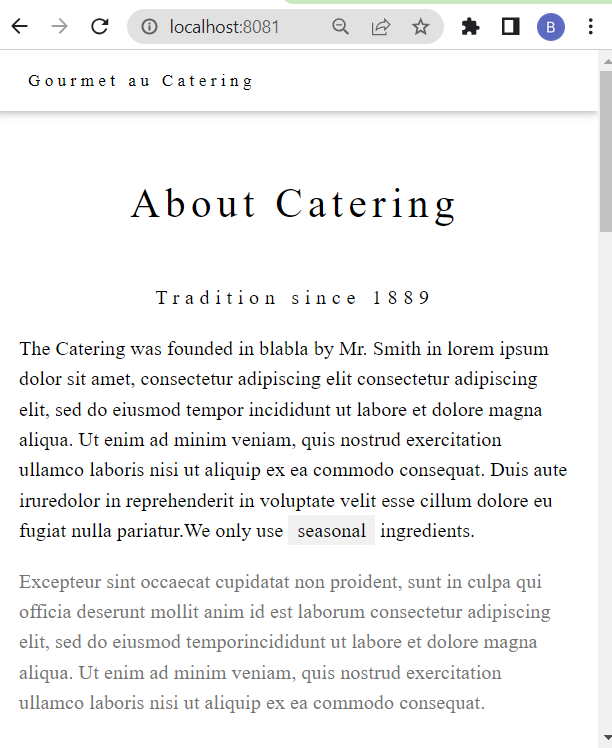

# Intro
This project builds a container image that includes the Apache HTTP Server and copies an HTML file named index.html into the root directory of the web server inside the container. This allows the Apache web server to serve the index.html file when accessed through a web browser.

The Apache HTTP Server is a free and open-source cross-platform web server software.

In Docker, an image is a file composed of various layers and is used to run code inside a Docker container, acting as a template. These images contain the initial file system on which the container will base its operation, as well as its entrypoint. In this case, the base image is httpd:2.4, which is a specific version of the Apache HTTP Server.

The Apache HTTP Server will automatically start when the container is executed. This means that the web server will be ready to receive and respond to web requests, including serving the index.html file mentioned in the Dockerfile.

More information:
- [docker and containers.](https://learn.microsoft.com/es-es/dotnet/architecture/microservices/container-docker-introduction/docker-containers-images-registries)
- The apache [HTTP ](https://hub.docker.com/_/httpd) image.

## How to use this repository
1. clone the repository
2. move to the right directory where the Dockerfile is located.
3. Run the next commands
```bash
$ docker build -t my-apache2 .
```
"docker Build" will create an image from a Dockerfile. Assigning a name and tag to the image.
```
$ docker run -dit --name my-running-app -p 8081:80 my-apache2
```
"docker run" is used to run a container from an image, specifying the necessary mapping ports.
<br><br>
4. Open your browser on 
```python
http://localhost:8081/
```
<br/>


